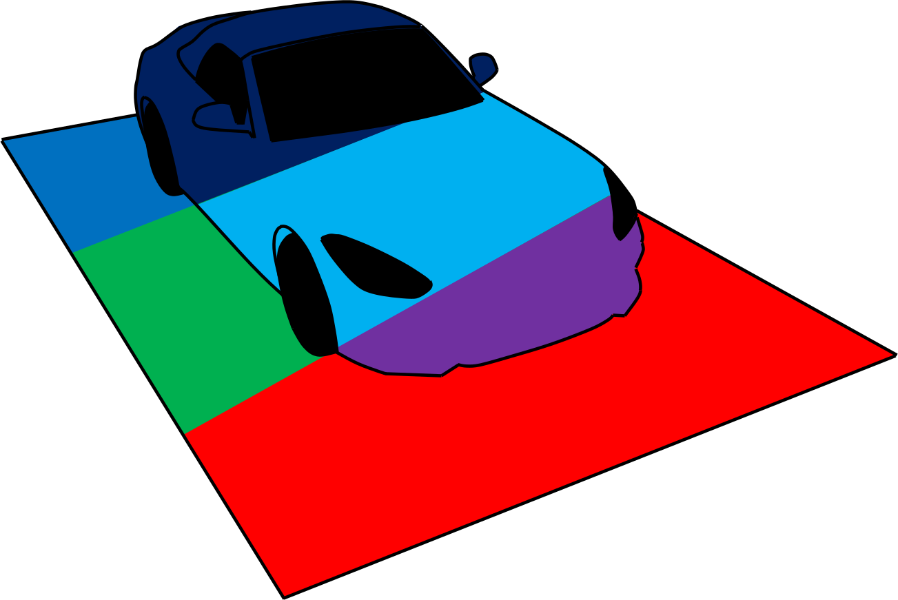
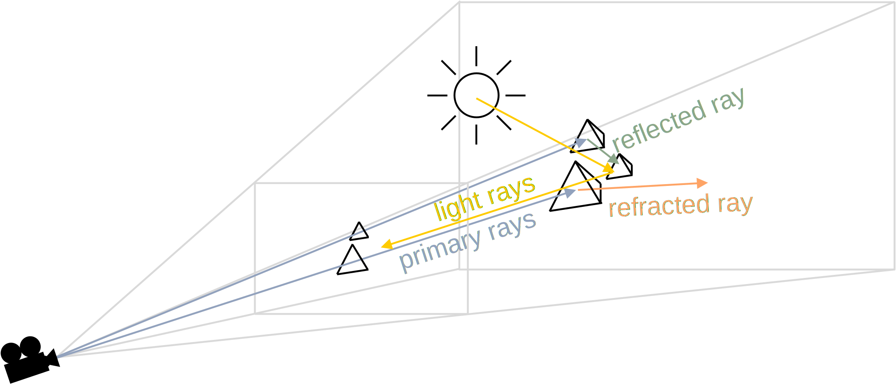
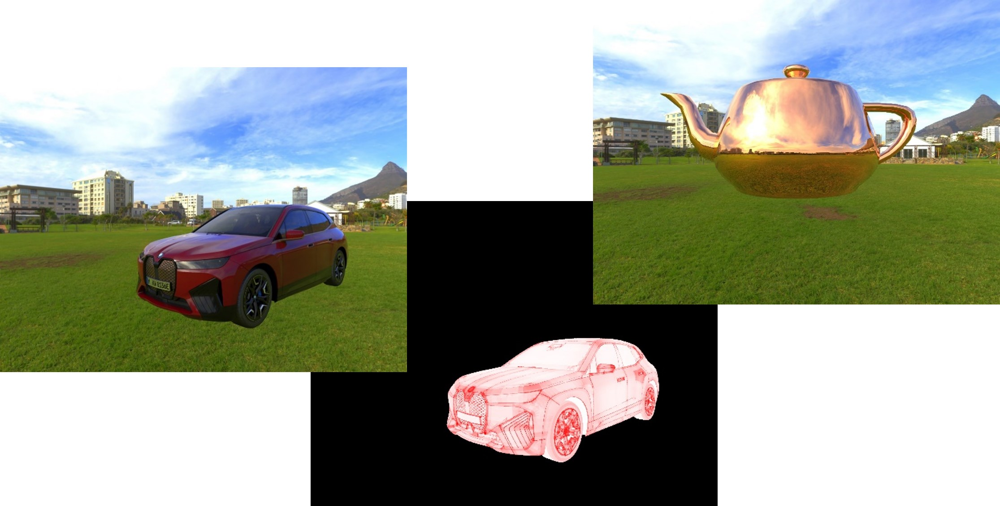

 Validation Tools and Examples for OpenMATERIAL
===============================================
Validation tools and examples for [Khronos Group glTF 2.0](https://github.com/KhronosGroup/glTF) 3D models, corresponding PBR materials and [OpenMATERIAL](https://github.com/LudwigFriedmann/OpenMATERIAL) materials.

Validation Tools
-----------------
Validation tools build on the **[OpenMATERIAL pathtracer](pathtracer/)** rendering software, featuring bi-directional pathtracing, point-source and HDRI (High Dynamic Range Image) based lighting and support for OpenMATERIAL materials and glTF PBR Metallic-Roughness materials at configurable camera and lighting parameters.

The OpenMATERIAL pathtracer features the following validation modes for 3D glTF models, OpenMATERIAL materials and glTF PBR materials:

* Light-box & scene rendering
* Primitive ID, Geometry ID and Material ID visualization
* Roughness map and  metallic map visualization (glTF PBR only)
* Mesh density visualization
* Surface gradient visualization
* Inverted normal visualization

The software was developed within the project [KI Data Tooling](https://www.ki-datatooling.de/) of the VDA Leitinitiative autonomous and connected driving and is funded by the [German Federal Ministry for Economic Affairs and Climate Action](https://www.bmwk.de/).

Examples
---------
Examples comprise [3D models](objects/) of generic vehicles and simple geometries in glTF file format, featuring glTF PBR materials and OpenMATERIAL materials. For the latter, physics-based examples of metals and construction materials can be found in the [materials](materials/) subdirectory. Examples of rendering [scene descriptions](scenes/), [HDRIs](hdr/), [lights](lights/) and [camera descriptions](cameras/) can be found in the corresponding subdirectories 

Repository Structure
--------------------

| Filepath                              | Description
|:--------------------------------------|:--------------------------------------------|
| [`cameras`](cameras/)                 | Examples of cameras                         |
| [`external`](external/)               | Third-party dependencies                    |
| [`hdr`](hdr/)                         | Examples of HDR (high dynamic range) images |
| [`lights`](lights/)                   | Examples of point-lights                    |
| [`materials`](materials/)             | Examples of OpenMATERIAL materials          |
| [`objects`](objects/)                 | Examples of 3D objects                      |
| [`pathtracer`](pathtracer/)           | Pathtracer implementation                   |
| [`scenes`](scenes/)                   | Examples of rendering scenarios             |

References
----------
tbd

