Objects
=======

This directory contains the following 3D models:

| Image                                                                                      | Filename                              | Description                                                           | Origin                                                             | License                                                         |
|:-------------------------------------------------------------------------------------------|:--------------------------------------|:----------------------------------------------------------------------|:-------------------------------------------------------------------|:----------------------------------------------------------------|
| 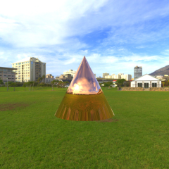                                           | `cone_gold.gltf`                      | Blender cone with OpenMATERIAL gold material                          | Created and exported using [Blender 2.8](https://www.blender.org/) | [CC-BY-SA 4.0](https://creativecommons.org/licenses/by-sa/4.0/) |
| 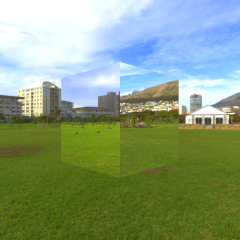                                 | `cube_aluminium.gltf`                 | Cube with OpenMATERIAL aluminium material                             | Created and exported using [Blender 2.8](https://www.blender.org/) | [CC-BY-SA 4.0](https://creativecommons.org/licenses/by-sa/4.0/) |
| 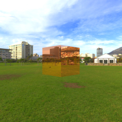                                           | `cube_gold.gltf`                      | Cube with OpenMATERIAL gold material                                  | Created and exported using [Blender 2.8](https://www.blender.org/) | [CC-BY-SA 4.0](https://creativecommons.org/licenses/by-sa/4.0/) |
| 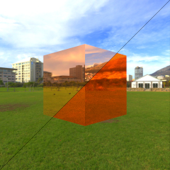                                   | `cube_pbr_gold.gltf`                  | Cube with red PBR material and OpenMATERIAL gold material             | Created and exported using [Blender 2.8](https://www.blender.org/) | [CC-BY-SA 4.0](https://creativecommons.org/licenses/by-sa/4.0/) |
| 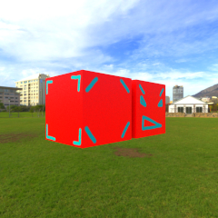                                           | `cubes_pbr.gltf`                      | Two cubes with PBR texture material sharing one mesh                  | Created and exported using [Blender 2.8](https://www.blender.org/) | [CC-BY-SA 4.0](https://creativecommons.org/licenses/by-sa/4.0/) |
| 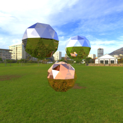 | `icospheres_gold_iron_aluminium.gltf` | Three icospheres with OpenMATERIAL gold, iron and aluminium materials | Created and exported using [Blender 2.8](https://www.blender.org/) | [CC-BY-SA 4.0](https://creativecommons.org/licenses/by-sa/4.0/) |
| 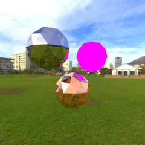     | `icospheres_gold_iron_missing.gltf`   | Three icospheres with OpenMATERIAL gold, iron and a missing material  | Created and exported using [Blender 2.8](https://www.blender.org/) | [CC-BY-SA 4.0](https://creativecommons.org/licenses/by-sa/4.0/) |
| 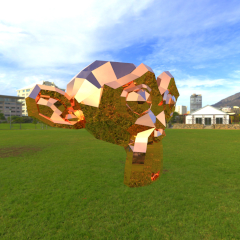                                       | `monkey_gold.gltf`                    | Blender monkey Suzanne with OpenMATERIAL gold material                | Created and exported using [Blender 2.8](https://www.blender.org/) | [CC-BY-SA 4.0](https://creativecommons.org/licenses/by-sa/4.0/) |
| 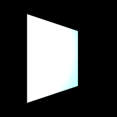                             | `plane_pointlight.gltf`               | Plane with blue PBR material lit by point-light                       | Created and exported using [Blender 2.8](https://www.blender.org/) | [CC-BY-SA 4.0](https://creativecommons.org/licenses/by-sa/4.0/) |
| 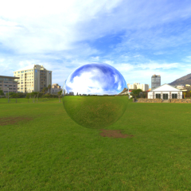                             | `sphere_aluminium.gltf`               | Sphere with OpenMATERIAL aluminium material                           | Created and exported using [Blender 2.8](https://www.blender.org/) | [CC-BY-SA 4.0](https://creativecommons.org/licenses/by-sa/4.0/) |
| 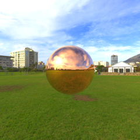                                       | `sphere_gold.gltf`                    | Sphere with OpenMATERIAL gold material                                | Created and exported using [Blender 2.8](https://www.blender.org/) | [CC-BY-SA 4.0](https://creativecommons.org/licenses/by-sa/4.0/) |
| 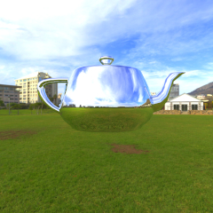                             | `teapot_aluminium.gltf`               | Blender teapot with OpenMATERIAL aluminium material                   | Created and exported using [Blender 2.8](https://www.blender.org/) | [CC-BY-SA 4.0](https://creativecommons.org/licenses/by-sa/4.0/) |
| 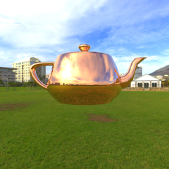                                       | `teapot_gold.gltf`                    | Blender teapot with OpenMATERIAL gold material                        | Created and exported using [Blender 2.8](https://www.blender.org/) | [CC-BY-SA 4.0](https://creativecommons.org/licenses/by-sa/4.0/) |
| 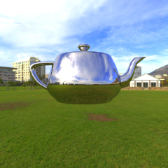                                       | `teapot_iron.gltf`                    | Blender teapot with OpenMATERIAL iron material                        | Created and exported using [Blender 2.8](https://www.blender.org/) | [CC-BY-SA 4.0](https://creativecommons.org/licenses/by-sa/4.0/) |
| 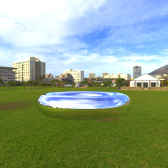                               | `torus_aluminium.gltf`                | Blender torus with OpenMATERIAL aluminium material                    | Created and exported using [Blender 2.8](https://www.blender.org/) | [CC-BY-SA 4.0](https://creativecommons.org/licenses/by-sa/4.0/) |
| 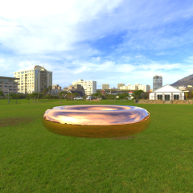                                         | `torus_gold.gltf`                     | Blender torus with OpenMATERIAL gold material                         | Created and exported using [Blender 2.8](https://www.blender.org/) | [CC-BY-SA 4.0](https://creativecommons.org/licenses/by-sa/4.0/) |
| 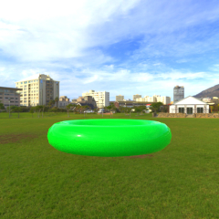                                           | `torus_pbr.gltf`                      | Blender torus with PBR neon green material                            | Created and exported using [Blender 2.8](https://www.blender.org/) | [CC-BY-SA 4.0](https://creativecommons.org/licenses/by-sa/4.0/) |
| 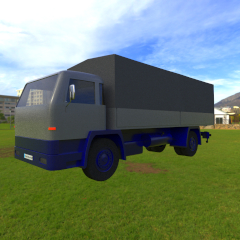                                   | `truck_example.gltf`                  | Truck example with multiple PBR materials                             | Created and exported using [Blender 2.8](https://www.blender.org/) | [CC-BY-SA 4.0](https://creativecommons.org/licenses/by-sa/4.0/) |
| 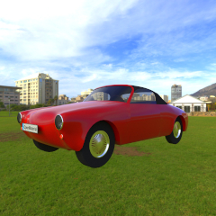                               | `vehicle_example.gltf`                | Vehicle example with multiple PBR materials                           | Created and exported using [Blender 2.8](https://www.blender.org/) | [CC-BY-SA 4.0](https://creativecommons.org/licenses/by-sa/4.0/) |