Physical Pathtracer
===================

This project implements a pathtracer to demonstrate the capabilities of the proposed [OpenMATERIAL glTF extensions](https://github.com/LudwigFriedmann/OpenMATERIAL/tree/master/glTF_extensions) for the [Khronos Group glTF 2.0](https://github.com/KhronosGroup/glTF) file format.
The implementation provides multiple rendering modes which can be used to validate glTF 3D models, glTF PBR materials and OpenMATERIAL materials.

Input for rendering are glTF 3D models (objects) or scenes of multiple objects. Examples can be found in the folders [`../objects/`](../objects/) and [`../scenes/`](../scenes/).
In their material section, objects may contain so-called [OpenMaterial_reference_links](https://github.com/LudwigFriedmann/OpenMATERIAL/tree/master/glTF_extensions/OpenMaterial_reference_link) to separate files specifying [OpenMaterial_material_parameters](https://github.com/LudwigFriedmann/OpenMATERIAL/tree/master/glTF_extensions/OpenMaterial_material_parameters) and other OpenMATERIAL glTF extensions providing frequency-specific material properties.

Material properties are used to compute reflections of light rays at the surface of objects. Light sources that emit light for these reflections can be discrete light sources or HDR (high definition range) background images.

In absence of discrete light sources, paths (rays) originating from the camera are traced for a fixed number of bounces or until they exit the scene.
The latter transfer light from the background image to the renderer image. Other sources of light contribution are e.g. objects with emissive materials which are hit by rays.
If discrete light sources (e.g. point-lights) are present in the scene, paths orginating from all light sources (randomly sampled based on intensity) are computed for each camera path. 
All possible connections of light paths and camera paths are considered. All unoccluded connections contribute light to the rendered image.

The pathtracer uses its own scene representation, which is not restricted to particular file formats, therefore enabling the development of interfaces for meshes, instances, materials, textures, lights and background.
The implementation allows multi-instancing of meshes. Normal and tangent vectors will be computed automatically in case they're not provided.
Finally, the pathtracer supports both OpenMATERIAL materials specified by proposed [OpenMATERIAL glTF extensions](https://github.com/LudwigFriedmann/OpenMATERIAL/tree/master/glTF_extensions) and glTF PBR materials defined by the [glTF BRDF implementation](https://registry.khronos.org/glTF/specs/2.0/glTF-2.0.html#appendix-b-brdf-implementation).
Even though individual meshes can only use one material, parallel implementation of glTF PBR materials and OpenMATERIAL materials is allowed. The pathtracer implementation allows material prioritization at render-time.

Compilation
-----------
The project source code can be compiled using [CMake](https://cmake.org/). On Linux systems, this requires the following commands:

```
$ mkdir bin
$ cd bin
$ cmake .. -DCMAKE_BUILD_TYPE=Release
$ make
```

> **_NOTE:_** [Intel Embree v4.1.0](https://github.com/embree/embree/releases/tag/v4.1.0) is fetched during CMake configuration. If this step isn't successful, please download `embree-4.1.0.x86_64.linux.tar.gz` or `embree-4.1.0.x64.windows.zip` manually and unpack it to [`../external/embree/`](../external/embree/).

The above will generate the executable `pathtracer` in the directory [`bin/`](bin/). The code is written in C++11 and dependant on
C++ [`std::threads`](https://en.cppreference.com/w/cpp/thread/thread) mechanism for parallelization.

The project was tested on Ubuntu 20.04 and Windows 10 (CMake & Visual Studio 2017). In the latter case,
the project can be compiled using:

``` 
$ mkdir bin
$ cd bin
$ cmake .. -G "Visual Studio 15 2017 Win64"
$ MSBuild PathTracer.sln /p:Configuration=Release /p:Platform=x64
```

Usage
-----
The pathtracer is executed using its command line interface. Running `pathtracer --help` will print usage instructions.
Mandatory parameters are `--input` or `-i` for the specification of the input glTF file, and `--hdr` for the specification of a
background HDR file or `-L` for enabling the usage of a point light. 

The following example renders a golden teapot at a resolution of 1200x1200 pixels on a Linux machine:

```
$ bin/pathtracer --resolution 1200 --aspect 1.0 --translation "0,-3,-8" --hdr ../hdr/green_point_park_4k.hdr --input ../objects/teapot_gold.gltf --output teapot_gold_hdr.jpg

Loading ../objects/teapot_gold.gltf
Loaded
Building scene
Built

Rendering scene
0 rows of 1200
  :   :   :   :
1150 rows of 1200
Rendered

Duration: x.xxxxx seconds
Saving image to teapot_gold_hdr.jpg
Saved
```

The rendered image is saved as `teapot_gold_hdr.jpg`:

<p align="center">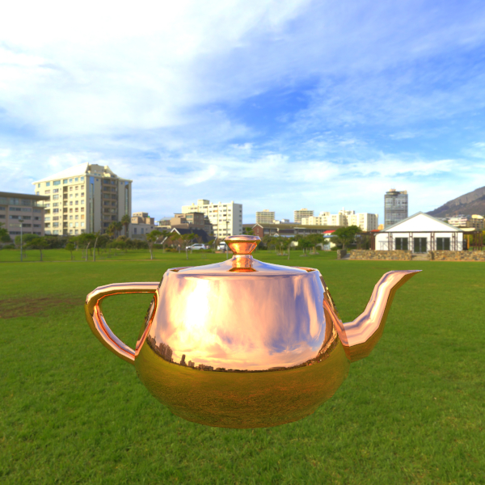</p>

On Windows, the above example can be executed using

```
$ bin\Release\pathtracer.exe --resolution 1200 --aspect 1.0 --translation "0,-3,-8" --hdr ..\hdr\green_point_park_4k.hdr --input ..\objects\teapot_gold.gltf --output teapot_gold_hdr.jpg
```

For more complex scenarios, the pathtracer provides a large variety of **command line arguments**:

```
-i, --input                 -> string, path to glTF file 
-A, --lightAttenuation      -> integer, light distance attenuation exponent (0=no attenuation, 1=linear attenuation, 2=quadratic attenuation, default = 1)
-a, --aspect                -> float, aspect ratio of the image, width-to-height ratio (default = 1.333333)
-B, --cameraBounces         -> integer, maximum number of bounces a camera ray can achieve (default = 10)
-b, --lightBounces          -> integer, maximum number of bounces a light ray can achieve (default = 10)
-C, --numberOfCores         -> integer, number of CPUs to use for rendering (default = 1)
-c, --automaticCentering    -> boolean, automatic scene centering (default = false)
-D, --denoiser              -> boolean, enables simple median denoiser and writes a denoised picture to the same directory (default = false)
-e, --eulerAngles           -> string, Euler angles (in degrees) of rotation in a right-handed system (Z axis pointing towards the user, default = (0, 0, 0)).
                               Order of angles: roll (bank angle, Z-axis), yaw (bearing, Y-axis), pitch (elevation, X-axis)
-F, --falseColor            -> string, subject of the false-color rendering mode (default = UNSPECIFIED):
                               Options: pid=primitiveId, gid=geometryId, mid=materialId, rmp=roughnessMap, mmp=metallicMap, md=meshDensity, sg=surfaceGradient, mn=materialName, in=invertedNormals
-g, --gamma                 -> float, gamma correction exponent (default = 0.5)
-H, --hdr                   -> string, path to HDR file (default = UNSPECIFIED)
-L, --lights                -> boolean, use light source from glTF file (default = false)
-l, --cameraLens            -> string, path to JSON file containing camera properties (default = UNSPECIFIED)
-o, --output                -> string, path to output file (supported extensions: .png, .bmp, .tga, .jpg and .pfm)
-P, --materialPriority      -> string, which material type has priority if both are used on the same mesh (om=OpenMaterial, pbr=pbrMetallicRoughness, default = om)
-q, --maxPathLength         -> integer, maximum length of connected path, i.e. path between the camera and a light source (default = 8)
-r, --resolution            -> integer, width resolution of the image (default = 800)
-S, --samples               -> integer, number of samples per each pixel (default = 20)
-T, --translation           -> string, XYZ translation of the glTF model (default = (0, 0, 0))
-t, --test                  -> boolean, run unit tests and exit
-V, --lightBox              -> boolean, enables light box validation (default = UNSPECIFIED)
-w, --writeToFile           -> string, reroute console output to a provided text file (default = UNSPECIFIED)
```

As an example, a more sophisticated Linux command to render the vehicle example may be:

```
$ bin/pathtracer -r 2400 -C 8 -T -1,-1,-4 -e 0,45,0 -H ../hdr/green_point_park_4k.hdr -i ../objects/vehicle_example.gltf -o vehicle_example_hdr.jpg -S 200 -b 100 -B 100
```

The same command may be executed on Windows as:

```
$ bin\Release\pathtracer.exe -r 2400 -C 8 -T -1,-1,-4 -e 0,45,0 -H ..\hdr\green_point_park_4k.hdr -i ..\objects\vehicle_example.gltf -o vehicle_example_hdr.jpg -S 200 -b 100 -B 100
```

These commands result in `vehicle_example_hdr.jpg`, a HDRI-based rendering of the vehicle example executed at 8 CPU cores, with 200 samples and a maximum number of 100 light ray bounces and camera ray bounces:

<p align="center"></p>

Denoising
---------
The pathtracer supports image denoising using a simple [Median filter](https://en.wikipedia.org/wiki/Median_filter).
The algorithm runs through the pixels of the rendered image pixel by pixel, replacing each pixel with the median of neighboring pixels.
The denoiser is enabled by command line parameter `-D` (or `--denoiser`).

Applied to the above example, the following picture emerges from denoising:

<p align="center">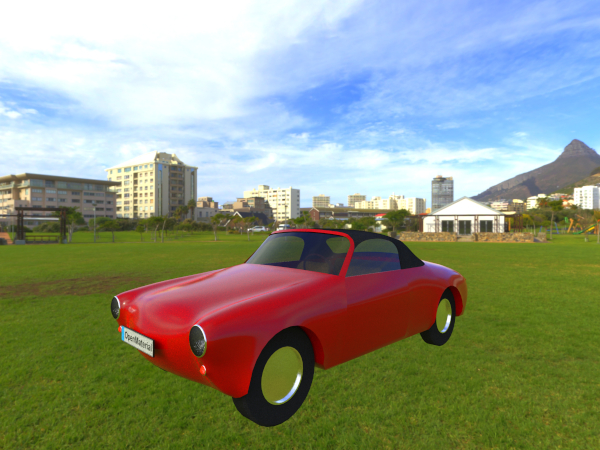</p>

Light-box rendering
-------------------
Light-box rendering is enabled with the help of option `-V` (or `--lightBox`).
This setting overwrites existing `--translation` and `--eulerAngles` settings.
Instead, the scene is displayed from the 8 corners of the bounding box.

Applied to the above example, the following 8 images are rendered:

<p align="center">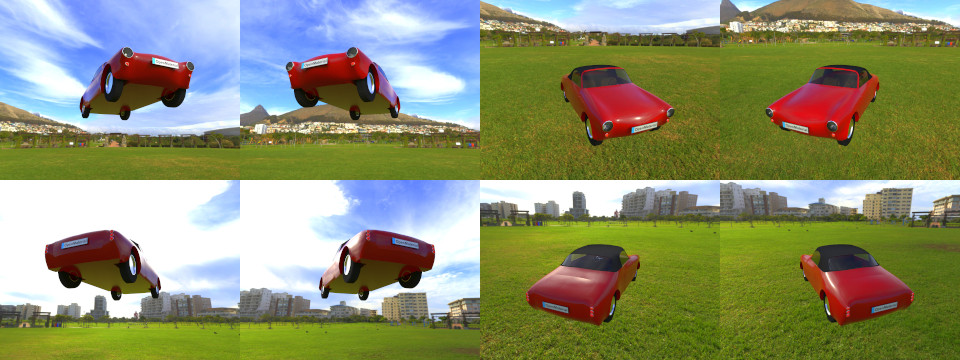</p>

Lights and Scenes
-----------------
The pathtracer supports **lights** for both glTF PPR materials and OpenMATERIAL materials. Lights are activated from the command line with the `-L` (or `--lights`) argument. Note that, if this flag is specified, **no** HDR background is being loaded.

Currently, only glTF point-light sources are supported as discrete light-sources. The following parameters can be defined for every point-light:

* Position
* Intensity
* Attenuation distance (can be infinity).

Using path tracer command line arguments, intensity can be multiplied by a user defined constant and the light attenuation model can be set.

Examples of lights can be found in [`../lights/`](../lights/).

**Scenes** allow the composition of multiple objects and light sources.
Here, OpenMaterial_reference_links can be used to reference other glTF files.
Examples of scenes can be found in [`../scenes/`](../scenes/).

The above example of the vehicle example can be rendered using the point-light based scene description [`../scenes/vehicle_pointlights.gltf`](../scenes/vehicle_pointlights.gltf) using the following Linux command:

```
$ bin/pathtracer -r 2400 -C 8 -T -1,-1,-4 -e 0,45,0 -L -i ../scenes/vehicle_pointlights.gltf -o vehicle_example_pointlight_scene.jpg -S 200 -b 100 -B 100
```

The corresponding Windows command would be:

```
$ bin\Release\pathtracer.exe -r 2400 -C 8 -T -1,-1,-4 -e 0,45,0 -L -i ..\scenes\vehicle_pointlights.gltf -o vehicle_example_pointlight_scene.jpg -S 200 -b 100 -B 100
```

<p align="center">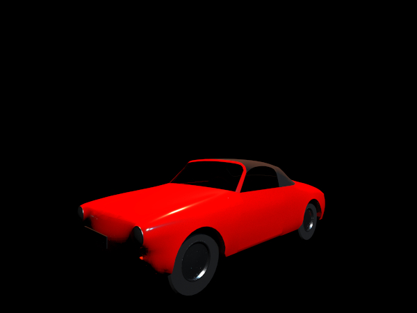</p>

Light-box rendering of the above results in the following 8 rendered images:

<p align="center">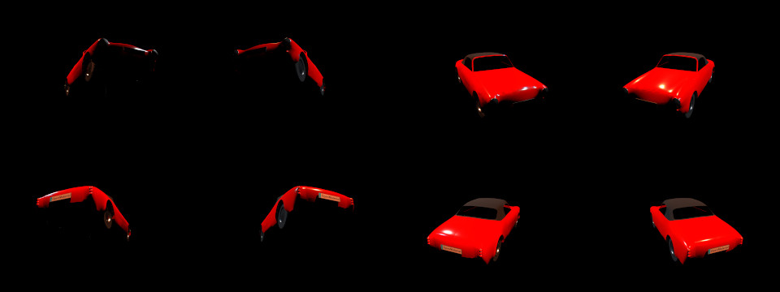</p>

Because of the way of its modelling currently **it isn't possible** to render OpenMATERIAL materials with point light source(s), unless there is at least one glTF PBR material on the scene.
This happens due to the fact that OpenMATERIAL material currently doesn't implement roughness and therefore always reflects light rays perfectly.
To construct a valid light path, the angles between incoming and outgoing rays with respect to the surface normal would have to be identical in this case.
This condition however is mathematically not reachable as a point-light source remains a point in the space.
In contrast, glTF PBR material supports surface roughness, which introduces randomness in the ray sampling and hence allows one to connect light rays under various angles.

Camera
------
The camera can be set up by providing a JSON file with required arguments. Examples can be found in [`../cameras/`](../cameras/).
By default the camera is situated at (0, 0, 1) and is oriented in negative z direction with an up-vector defined by positive y direction.

False Color Rendering
---------------------
False color asset validation can be enabled by an additional build flag `PT_VALIDATION` in the `CMakeLists.txt`, e.g. by adding the command line argument `-DPT_VALIDATION=ON` to the `cmake` command (see Compilation chapter).

At render-time, false color rendering is activated by command line option `-F xxx` (or `--falseColor xxx`) with xxx specifying the subject of FC rendering:

| FC subject             | Output image                                                               | Description                                                                                                             | Note                                                                                                                                                                                                                                   |
|:----------------------:|:---------------------------------------------------------------------------|:------------------------------------------------------------------------------------------------------------------------|:---------------------------------------------------------------------------------------------------------------------------------------------------------------------------------------------------------------------------------------|
| `pid` (primitiveId)    | 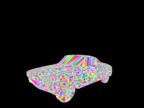    | Assigns pre-randomed hashed colors based on the primitive index.                                                        |                                                                                                                                                                                                                                        |
| `gid` (geometryId)     | 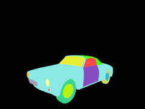     | Assigns pre-randomed hashed colors based on the geometry index.                                                         |                                                                                                                                                                                                                                        |
| `mid` (materialId)     | 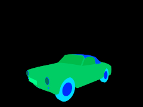     | Assigns pre-randomed hashed colors based on the material index. Missing materials are highlighted by bright-pink color. |                                                                                                                                                                                                                                        |
| `rmp` (roughnessMap)   | 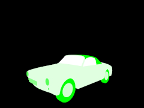   | Assigns unique colors based on material roughness value. Colors range from white (low) to pure green (high).            | Not supported by OpenMATERIAL materials.                                                                                                                                                                                               |
| `mmp` (metallicMap)    | 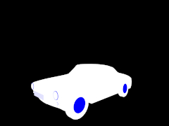    | Assigns unique colors based on material metallicness value. Colors range from white (low) to pure blue (high).          | Not supported by OpenMATERIAL materials.                                                                                                                                                                                               |
| `md` (meshDensity)     | 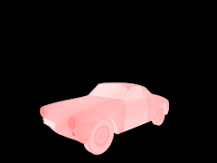     | Assigns unique one-channel colors based on mesh density value. Colors range from white (low) to pure red (high).        |                                                                                                                                                                                                                                        |
| `sg` (surfaceGradient) | 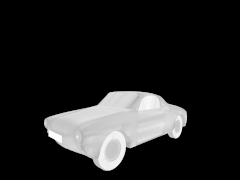 | Assigns unique one-channel colors based on surface gradient value. Colors range from white (low) to pure black (high).  | Scaled such that a normal deviaton of 10 degrees is spread over half of the bright-part of a gray-scale range.                                                                                                                         |
| `mn` (materialName)    | 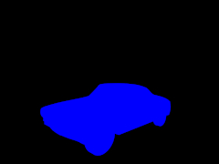    | Assigns unique colors based on material type (name). Missing material are highlighted by bright-pink color.             | Material name-color mapping is defined in the [source code file](src/scene/RenderScene.cpp). Missing materials **don't** have to be mentioned explicitly. glTF PBR material is depicted blue, OpenMATERIAL material is depicted green. |
| `in` (invertedNormals) | 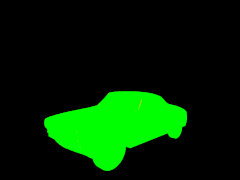  | Assigns binary colors based on whether an inverted normal is met (red) or not (green).                                  | **Doesn't** account for transparent materials.                                                                                                                                                                                         |

As an example, primitive IDs of the vehicle example can be rendered using the Linux command

```
$ bin/pathtracer -r 2400 -C 8 -T -1,-1,-4 -e 0,45,0 -i ../objects/vehicle_example.gltf -o vehicle_example_pid.jpg -F pid
```

The same command may be executed on Windows as:

```
$ bin\Release\pathtracer.exe -r 2400 -C 8 -T -1,-1,-4 -e 0,45,0 -i ..\objects\vehicle_example.gltf -o vehicle_example_pid.jpg -F pid
```

Testing
--------
Unit tests can be executed using the command line option `-t` (or `--test`).  

Documentation
-------------
Source code documentation is generated using doxygen:

```
doxygen doxygen.conf
```
Documentation will be written to the `docs/` directory.

Input File Formats
------------------
The pathtracer supports the following input file formats for 3D models:

* GLTF separate - (.gltf/.bin) including textures, glTF PBR materials and OpenMATERIAL materials
* GLTF binary - (.glb) including textures, glTF PBR materials and OpenMATERIAL materials

For glTF PBR materials, the Metallic-Roughness workflow is supported.
This workflow comprises the following material properties (each represented either by global values or texture maps):

* Base color
* Normal
* Metallic/Roughness
* Emissive
* Occlusion

Only 2D textures with one byte per color channel are supported.
GlTF KHR_materials extensions are not supported.

Output File Formats
------------------
The pathtracer supports the following output file formats:

* BMP - Bitmap image
* JPG - Joint Photographic (Experts) Group image
* PFM - Portable FloatMap image
* PNG - Portable Network Graphics image
* TGA - Truevision Graphics Adapter image

Third party software
--------------------
This project depends on third party software. The corresponding code and/or references can be found in the directory [`../external/`](../external/).
